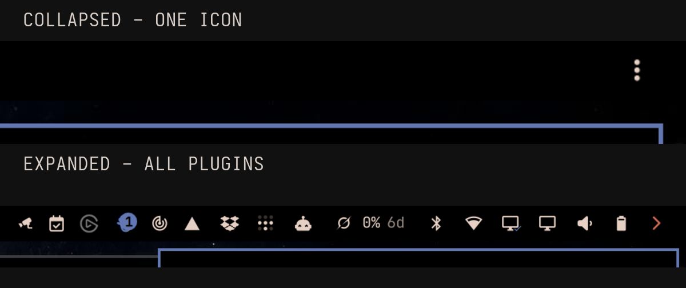

# App Drawer

A compact, per-monitor drawer for Omarchy Shell's stock bar. It keeps the stock bar and its background services mounted, then smoothly reveals or collapses the widgets to the right of the drawer.

[User guide](https://bolens.github.io/omarchy-app-drawer/) · [Report an issue](https://github.com/bolens/omarchy-app-drawer/issues/new/choose) · [Security policy](SECURITY.md)



_Collapsed and expanded states are shown at the same capture width for a direct comparison._

## Highlights

- Independent expanded/collapsed state and click-or-hover behavior per monitor.
- Four deterministic reveal styles: Taskbar wipe, Cascade, Soft cascade, and Uniform reveal. Instant mode disables the transition.
- Smooth, Quick, Gentle, and Linear motion curves with a 250 ms default and topology-stable slot bindings.
- Configurable glyphs, spacing, colors, actions, animation style, duration, curve, and hover-close delay.
- Always-visible pins for selected right-side widgets.
- Keyboard-focusable controls and named assistive-technology actions for settings and bar interaction.
- Lightweight bar-widget and service entry points; they do not replace the stock bar or launch another Quickshell.
- Deterministic state updates, bounded attachment retries, guarded settings loading, and compatibility IPC.

Click the drawer glyph to toggle only that monitor. Right-click opens the compact settings panel; middle-click does too by default. In **Appearance**, each monitor can independently use **Click toggle** or **Hover reveal**. Reveal appearance is shared across monitors, while expanded state and interaction mode remain per-monitor. Pins are shared because the bar layout itself is shared.

## Installation

```sh
omarchy plugin add https://github.com/bolens/omarchy-app-drawer.git --enable
scripts/migrate-to-stock-bar
```

The idempotent migration switches to `omarchy.bar`, replaces the legacy `io.github.amitcpatel.omabar-drawer` layout entry when present, installs `io.github.bolens.app-drawer`, and backs up `shell.json`.

## Remove

```sh
omarchy bar reset
omarchy plugin remove io.github.bolens.app-drawer
```

Removing the plugin does not delete your other bar layout or widget settings. `omarchy bar reset` switches back to the stock Omarchy bar before removal.

## Requirements and dependencies

- Omarchy Quattro 4.0 or newer with bar-widget and service plugin support.
- The standard Omarchy shell and its bundled QML modules.
- A Nerd Font supplied by Omarchy for the drawer glyphs.

There are no external packages, downloads, services, accounts, API keys, or network dependencies.

## Configuration and privacy

App Drawer reads the existing `bar.layout` section from `~/.config/omarchy/shell.json`. It changes configuration only after an explicit user action. Per-monitor visibility and mode are stored under the bar drawer state; appearance and shared pins are stored alongside them. Writes are normalized and serialized through one service.

The plugin performs no network requests, telemetry, credential access, privilege escalation, package installation, or service management. It does not launch Quickshell or detached processes. Test harnesses use isolated temporary Quickshell paths and kill exactly those paths when finished.

## IPC

The IPC target is `app-drawer`. It provides versioned status and settings inspection, deterministic `registeredMonitors` discovery, global `expand`, `collapse`, `setExpanded`, and `toggle`, plus monitor-specific `setMonitorExpanded`, `toggleMonitor`, `setMonitorMode`, and `monitorStatus`. `openMonitorSettings`, `openMonitorAppearance`, and `settingsStatusFor` address an exact registered monitor. It also exposes guarded appearance updates, pin/unpin/reset, and global settings open/close methods. Unknown modes and non-object appearance payloads are rejected without mutating configuration. Run `qs ipc show` against the Omarchy Shell instance for the exact signatures.

Persisted drawer state is normalized through a versioned, idempotent migration. Rapid settings-panel edits are merged into one bounded commit, unchanged requests do not write configuration, and failed commits retain the previous state with visible feedback.

## Development

This fork follows the same persistent-service, guarded-IPC, compact-settings, deterministic-test, and exact-path QML harness patterns used by [P2P Services](https://github.com/bolens/omarchy-p2p-services) and [Privacy Devices](https://github.com/bolens/omarchy-privacy-devices). The legacy full-bar implementation remains only as migration and licensing reference; it is not a manifest entry point.

Run `npm test` for deterministic model cases, randomized invariants, migration/deployment safety, crash guards, isolated QML runtime harnesses, QML linting, manifest validation, and live IPC checks. Set `OMABAR_QML_TESTS=never` to skip isolated QML, `OMABAR_LIVE_TESTS=never` to skip live checks, `OMABAR_LIVE_TESTS=always` to require a live shell, or `OMABAR_STRESS_TESTS=always` for concurrent IPC stress. Use `scripts/deploy-shell-runtime` to copy and byte-verify runtime files into an existing installation before restarting Omarchy Shell.

Run `scripts/capture-screenshots --verify` to record collapsed, expanded,
settings, and animation evidence without retaining files. To inspect the files,
pass an empty directory below `/tmp` with `--audit-dir`. The capture restores
the prior appearance, monitor state, interaction mode, and open panel. It also
checks that the Quickshell process inventory does not change.

## Credits and license

This is a modified hard fork of [OmaBar Drawer](https://github.com/amitcpatel/omabar-drawer) by Amit Patel, which derives from Omarchy's bar by David Heinemeier Hansson. Hard-fork architecture and subsequent work are by bolens. The upstream notices are preserved under the MIT license in [LICENSE](LICENSE); see [NOTICE](NOTICE) for provenance.
